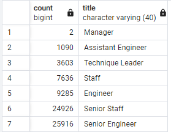

# Pewlett Hackard Analysis

## Overview of The Analysis

The purpose of this is analysis is to create a few new tables to meet the requirements of Bobby's manager. He would like to know the number of retiring employees per title and to identity the employees who are eligible to participate in a mentorship program. Four new tables have been created with the data requested: retirement_titles.csv, unique_titles.csv, retiring_titles.csv, and mentorship_eligibility.csv. The Summary will provide some insights as how to best deal with the "silver tsunami" of retiring employees.

## Results

### Retiring Employees by Title

The first task was to get a count of the number of employees who will be retiring by the position they hold. In order to retrieve the necessary data 3 tables were created.

- The first table filtered the data by employees who are nearing the retirement age (born betweem 1952-1955). The data retrieved helps answer the question of how many employees are within retirement age; however it also contains the former employees as well. Counting the number of employees in this table will not give an accurate count for their current need. The data also reveals duplicate employees who have transitioned into different positions. This will skew the data and give the incorrect total count of employees. 

- The second table filtered the data so that only current employees, nearing the retirement age, are shown and there are no more duplicate employees. The data shows only the current position held by the employees.

- The third table shows answers the question at hand: How many current employees based on their title are reaching retirement age. 

### Mentorship Eligibility

- The fourth table has taken all the information gathered thus far and created a full list of current employees who are reaching retirement age and are thus eligible for the mentorship program.

## Summary

1. How many roles will need to be filled?
    - As the "silver tsunami" approaches, the company will have a large number of employees who will either be retiring or enrolling in a mentorship program. Currently there are 1549 possible mentors born in 1965. However there are a predicted 72,458 employees born between 1952-1955 who are at retirement age. There is a large gap in possible mentors and spots that need to be filled. It would be wise to create a larger pool of possible mentors who can begin training current employees, who can then train future employees.

2. Are there enough qualified mentors?
    - When a count is done on the unique titles table by title. We have now a number of possible candidates who were born between 1952-1955. In this pool of possible mentor candidates, there are a large number of Seniors and Leaders. These are possible mentors the company can reach out to in order to help meet the need for the upcoming "silver tsunami." 

    